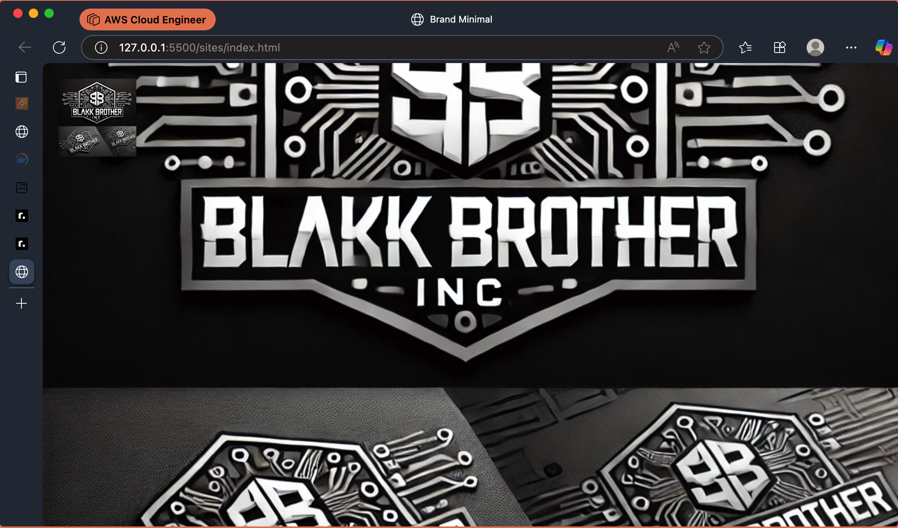
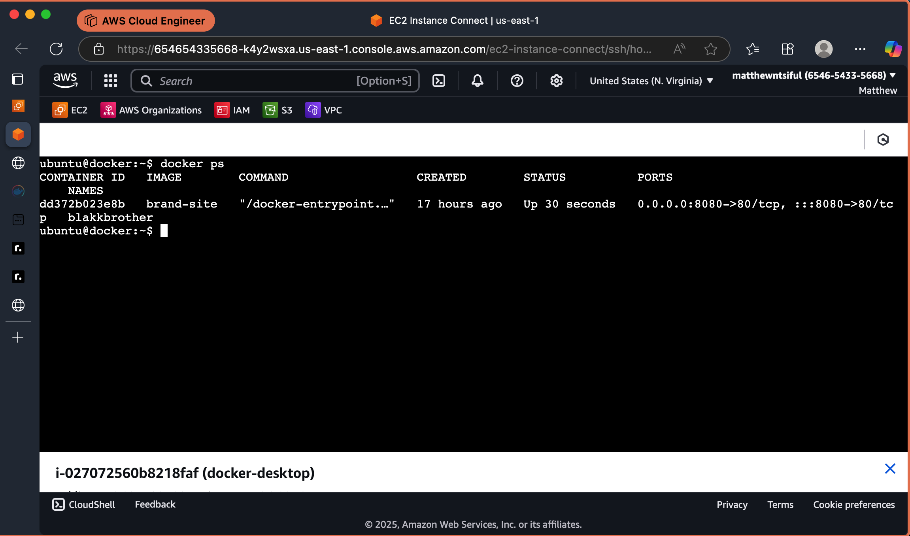

# Static Website Project

[](https://nginx.org/)
[](https://www.docker.com/)
[](https://aws.amazon.com/)
[](https://pages.github.com/)

## Table of Contents

- [Project Overview](#project-overview)
- [Project Workflow](#project-workflow-diagram)
- [Technologies Used](#technologies-used)
- [Prerequisites](#prerequisites)
- [Getting Started](#getting-started)
- [Project Structure](#project-structure)
- [Implementation Guide](#implementation-guide)
  - [Day 1: Git Repository Setup](#day-1-git-repository-setup)
  - [Day 2: Environment Configuration](#day-2-environment-configuration)
  - [Day 3: Create Static Website](#day-3-create-static-website)
  - [Day 4-5: Dockerization](#day-4-5-dockerization)
- [AWS Deployment](#aws-deployment)
- [GitHub Pages Deployment](#github-pages-deployment)
- [Troubleshooting](#troubleshooting-guide)
- [Further Reading](#further-reading)

## Project Overview

This project focuses on deploying a static website using Nginx, Docker, and AWS EC2. It's designed to practice essential DevOps skills including Linux commands, Git version control, Bash scripting, Docker containerization, Nginx configuration, and basic AWS EC2 provisioning.

### Deployment Status

The project has been successfully:

- Built locally and tested for connectivity
- Deployed to an AWS EC2 instance via containerization
- Deployed to GitHub Pages for easy access
- Verified for connectivity in the cloud environment

## Project Workflow Diagram

```ascii
+------------------+     +--------------------+     +-------------------+
|                  |     |                    |     |                   |
|  Local Dev       |     |  Docker Container  |     |  AWS EC2 Instance |
|  Environment     | --> |  with Nginx        | --> |  Deployment       |
|  (HTML/CSS)      |     |  (Alpine Image)    |     |  (Public Access)  |
|                  |     |                    |     |                   |
+------------------+     +--------------------+     +-------------------+
      |                           ^
      |                           |
      v                           |
+------------------+     +--------------------+
|                  |     |                    |
|  Git Repository  |     |  Bash Scripts for  |
|  Version Control | --> |  Environment Setup |
|  (GitHub)        |     |  & Automation      |
|                  |     |                    |
+------------------+     +--------------------+
```

This diagram illustrates the flow from local development to cloud deployment, showing how the static website is developed locally, containerized with Docker using an Nginx Alpine image, and finally deployed to an AWS EC2 instance for public access. The process is supported by Git for version control and Bash scripts for automation.

## Technologies Used

| Technology | Version | Purpose |
| ---------- | ------- | ------- |
| Nginx | 1.21.6 (Alpine) | Web server for hosting static content |
| Docker | 20.10.x | Containerization platform |
| AWS EC2 | Ubuntu 20.04 LTS | Cloud hosting environment |
| GitHub Pages | Latest | Static site hosting service |
| Git | 2.30+ | Version control system |
| Bash | 5.0+ | Automation scripting |
| HTML/CSS | HTML5/CSS3 | Frontend static website content |

## Goals

- Practice Linux commands and system management
- Learn Git workflow and version control
- Create and use Bash scripts for automation
- Containerize a website with Docker
- Configure Nginx as a web server
- Deploy to AWS EC2

## Prerequisites

Before starting this project, ensure you have:

- Git installed locally
- Docker installed locally
- Basic knowledge of HTML/CSS
- AWS account (for EC2 deployment)
- Terminal/command line familiarity
- Text editor or IDE of your choice

## Project Timeline

### Day 1: Set Up Your GitHub Repository (⏱️ ~1 hour)

- Create a GitHub repository named 'static-website-project'
- Clone it to your local machine
- Add a README.md with your project overview
- Make initial commit to GitHub

**Skills Practiced:** Git basics, version control workflow  
**Key Concepts:** `git init`, `clone`, `add`, `commit`, `push`, branching basics

### Day 2: Basic Linux Commands Refresher & Bash Setup Script (⏱️ ~2 hours)

- Write a Bash script (`setup.sh`) that:
  - Updates system packages
  - Installs 'nginx', 'git', and 'docker' (for Debian/Ubuntu)
  - Starts and enables services

**Skills Practiced:** Bash scripting, Linux package management  
**Key Concepts:** `chmod +x`, `#!/bin/bash`, automation via Bash

### Day 3: Create Static Website (⏱️ ~2-3 hours)

- Use HTML/CSS to build a basic homepage
- Add this to your 'static-website-project' Git repo

**Skills Practiced:** Git workflow, file structure for web projects  
**Key Concepts:** Version tracking changes to HTML/CSS

### Day 4-5: Containerize the Website with Docker (⏱️ ~3-4 hours)

- Create a Dockerfile that:
  - Uses an Nginx base image
  - Copies your static site into the default Nginx HTML directory

## Requirements

- Git installed locally
- Docker installed locally
- Basic knowledge of HTML/CSS
- AWS account (for EC2 deployment)

## Getting Started

### Step 1: Clone this repository

```bash
git clone https://github.com/matthewntsiful/static-website-project.git
cd static-website-project
```

### Step 2: Set up your environment

The included setup script will install all necessary dependencies (Nginx, Git, Docker) and configure initial services.

```bash
chmod +x setup.sh
./setup.sh
```

### Step 3: Create your static website content

Place your HTML, CSS, and image files in the website directory following the project structure below. At minimum, create an `index.html` file:

```bash
mkdir -p website/css website/images
touch website/index.html
```

### Step 4: Build and run the Docker container

```bash
docker build -t static-website .
docker run -d -p 80:80 static-website
```

### Step 5: Verify your local deployment

Open your browser and navigate to `http://localhost` or use curl to verify:

```bash
curl http://localhost
```

## Project Structure

```text
├── README.md
├── setup.sh
├── website/
│   ├── index.html
│   ├── css/
│   └── images/
├── screenshots/
│   ├── local-test.png
│   ├── ec2-deployment.png
│   └── nginx-container.png
└── Dockerfile
```

## Implementation Guide

### Day 1: Git Repository Setup

```bash
git init
git remote add origin https://github.com/matthewntsiful/static-website-project.git
git push -u origin main
```

### Day 2: Environment Configuration

```bash
chmod +x setup.sh
./setup.sh
```

### Day 4-5: Dockerization

#### Nginx Containerization

```dockerfile
FROM nginx:alpine
COPY site/ /usr/share/nginx/html
EXPOSE 80
CMD ["nginx", "-g", "daemon off;"]
```

#### Local Validation

```bash
curl http://localhost
```

## AWS Deployment

### EC2 Instance Configuration

- Security Group: Allow SSH(22) + HTTP(80)
- Key Pair: website-key.pem

### EC2 Deployment Workflow

1. Project was successfully built and tested locally
2. Code was pushed to the GitHub repository
3. Repository was cloned to an AWS Ubuntu EC2 instance
4. Application was containerized using Docker on the EC2 instance
5. Nginx web server was configured within the container
6. Deployment was tested and verified successfully

### Deployment Screenshots

#### Local Deployment Test



#### AWS EC2 Deployment


#### Nginx Container Running



## Troubleshooting Guide

| Issue | Solution | Command Example |
| ----- | -------- | --------------- |
| Docker permission denied | Add user to docker group | `sudo usermod -aG docker $USER` then `newgrp docker` |
| Port 80 conflict | Find and kill the process using port 80 | `sudo lsof -i :80` then `sudo kill -9 PID` |
| EC2 connection refused | Verify Security Group rules | Check inbound rules for ports 22 and 80 in AWS Console |
| Nginx 404 errors | Check file paths in Dockerfile | Ensure COPY command uses correct paths |
| Docker build fails | Check Dockerfile syntax | Validate with `docker build --no-cache .` |

## Contributing

Contributions are welcome! Please feel free to submit a Pull Request.

## Contact

For questions or feedback about this project, please open an issue in the GitHub repository.

## GitHub Pages Deployment

This project is also deployed on GitHub Pages for easy access and demonstration.

### Live Demo

🔗 [View Live Demo](https://matthewntsiful.github.io/static-website-project/)

### GitHub Pages Setup

The website is deployed directly from the repository using GitHub Pages:

1. Static website files are placed in the root directory
2. A `.nojekyll` file is added to prevent Jekyll processing
3. GitHub Pages is configured to serve from the main branch

To update the site:

1. Make changes to the HTML, CSS, or image files
2. Commit and push to the repository
3. GitHub Pages will automatically rebuild and deploy the site

## Further Reading

- [Nginx Documentation](https://nginx.org/en/docs/)
- [Docker Documentation](https://docs.docker.com/)
- [AWS EC2 User Guide](https://docs.aws.amazon.com/ec2/)
- [GitHub Pages Documentation](https://docs.github.com/en/pages)
- [Git Documentation](https://git-scm.com/doc)
- [Bash Scripting Tutorial](https://www.gnu.org/software/bash/manual/bash.html)
- [HTML/CSS - MDN Web Docs](https://developer.mozilla.org/en-US/docs/Web/HTML)
- [DevOps Roadmap](https://roadmap.sh/devops)
